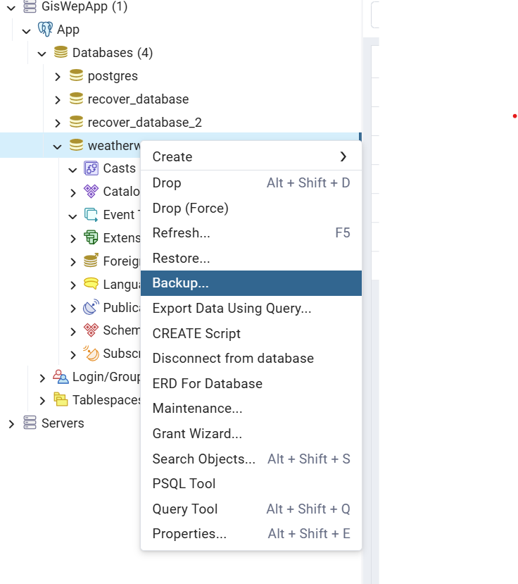
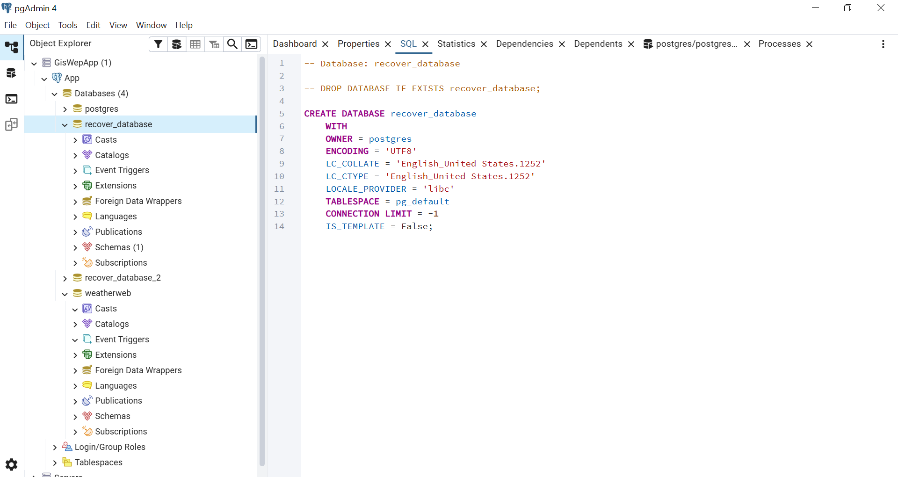
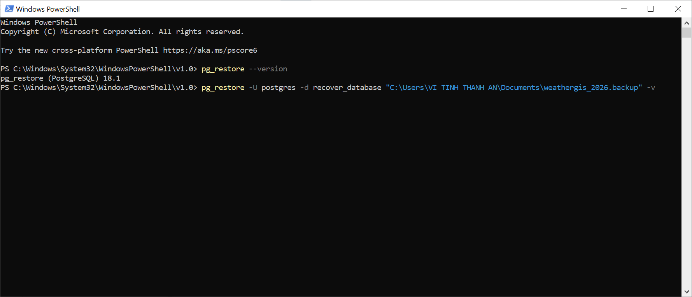
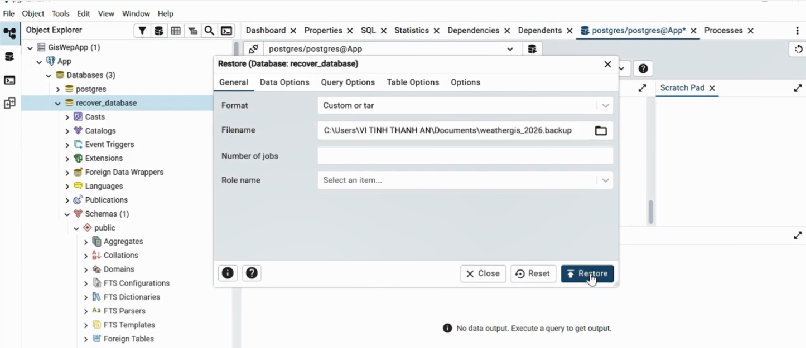
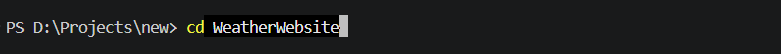
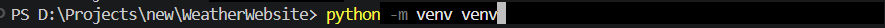
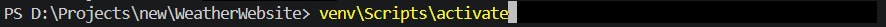
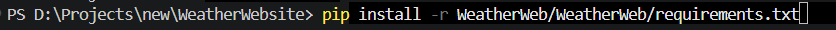
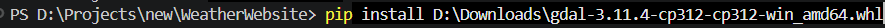
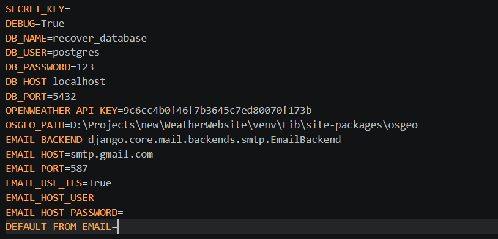

# HƯỚNG DẪN CÀI ĐẶT

## Chương 1: Setup database từ file backup

### Bước 1: Chọn database cần backup, nhấn chuột phải và chọn Backup.



### Bước 2: Nhấn vào icon ở mục Filename -> chọn folder chứa file backup -> tại mục save as type chọn BACKUP File .backup -> Nhấn Save.

### Bước 3: Chạy lệnh SQL sau để tiến hành tạo database mới:



### Bước 4: Mở Windows PowerShell và chạy lệnh sau để thực hiện phục hồi dữ liệu (backup):



Giải thích lệnh: Trong đó postgres là tên user, recover_database là tên database vừa tạo ở Bước 3, và phần cuối là đường dẫn đến file .backup đã tạo ở Bước 2.

Cách khác: Bạn có thể chuột phải vào database mới tạo, chọn Restore và trỏ đến file .backup.



## Chương 2: Setup dự án

### Bước 1: Chuẩn bị môi trường:

- Cài đặt Python 3.12.4 và kết nối vào VS Code.
- Tải file thư viện gdal-3.11.4-cp312-cp312-win_amd64.whl.
- Cài đặt PostgreSQL (lưu ý nhớ mật khẩu đăng nhập).

### Bước 2: Sử dụng Terminal trong VS Code, chạy lệnh git clone để lấy mã nguồn:

Bash
```bash
git clone https://github.com/TanNguyen234/WeatherWebsite.git
```


### Bước 3: Di chuyển vào thư mục dự án vừa tải về:

Bash
```bash
cd WeatherWebsite
```



### Bước 4: Tạo môi trường ảo (virtual environment) để quản lý thư viện:

Bash
```bash
python -m venv venv
```



### Bước 5: Kích hoạt môi trường ảo vừa tạo:

Bash
```bash
venv\Scripts\activate
```



### Bước 6: Cài đặt các thư viện cần thiết từ file requirements:

Bash
```bash
pip install -r WeatherWeb/WeatherWeb/requirements.txt
```



### Bước 7: Cài đặt thư viện GDAL (Lưu ý sửa lại đường dẫn file .whl cho đúng với nơi bạn đã lưu ở Bước 1):

Bash
```bash
pip install D:\Downloads\gdal-3.11.4-cp312-cp312-win_amd64.whl
```



### Bước 8: Tạo file .env tại đường dẫn WeatherWeb/WeatherWeb/.env với các nội dung cấu hình sau:



Hướng dẫn điền thông tin file .env:

- SECRET_KEY: Điền một chuỗi ký tự ngẫu nhiên bất kỳ (khuyến nghị trên 20 ký tự).
- DB_NAME: Tên database bạn đã tạo trong PostgreSQL.
- DB_USER: Tên người dùng database (thường là postgres).
- DB_PASSWORD: Mật khẩu của người dùng database đó.
- EMAIL_HOST_USER: Email dùng để gửi tin nhắn tự động từ hệ thống.
- EMAIL_HOST_PASSWORD: Mật khẩu ứng dụng (App Password) của email trên.
- DEFAULT_FROM_EMAIL: Có thể điền giống với EMAIL_HOST_USER.

### Bước 9: Chạy dự án bằng lệnh:

Bash
```bash
python WeatherWeb/manage.py runserver
```


